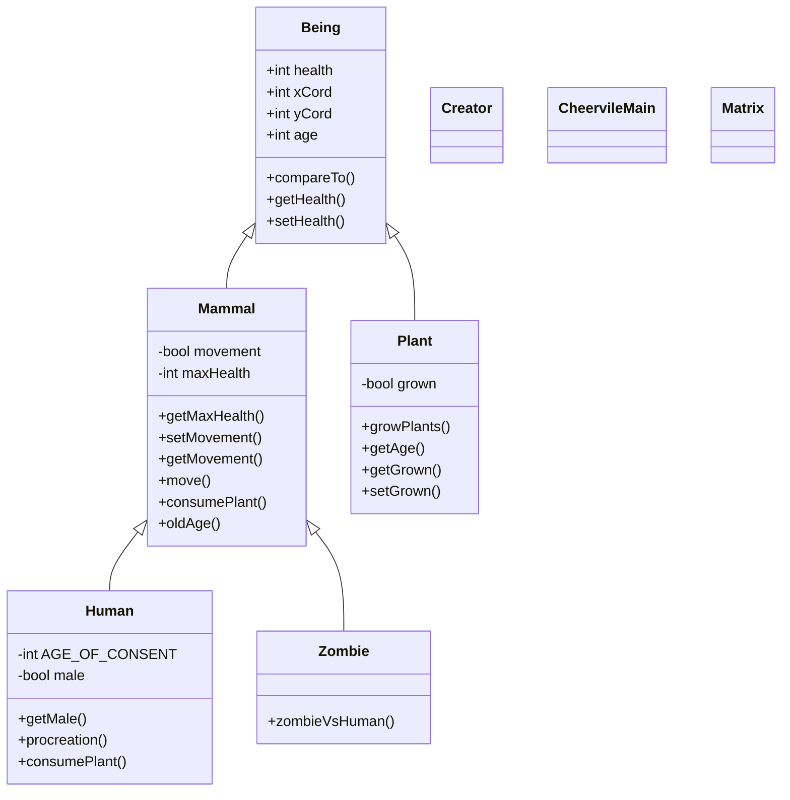

# Ecosystem-Simulation

- Human, Zombie, Plant object interactions in an ecosystem like simulation
- Graphics with JFrame
- Practise w/ principles of Object Oriented Design

```mermaid
classDiagram

Being <|-- Mammal
Being <|-- Plant
Mammal <|-- Human
Mammal <|-- Zombie


class Being {
	+int health
	+int xCord
	+int yCord
	+int age
	+compareTo()
	+getHealth()
	+setHealth()
}

class Mammal {
	-bool movement
	-int maxHealth
	+getMaxHealth()
	+setMovement()
	+getMovement()
	+move()
	+consumePlant()
	+oldAge()
}

class Human {
	-int AGE_OF_CONSENT
	-bool male
	+getMale()
	+procreation()
	+consumePlant()
}

class Zombie {
	+zombieVsHuman()
}

class Plant {
    -bool grown
    +growPlants()
	+getAge()
	+getGrown()
	+setGrown()
}

class Creator {
	
}
class CheervileMain {
	
}
class Matrix {
	
}

```
